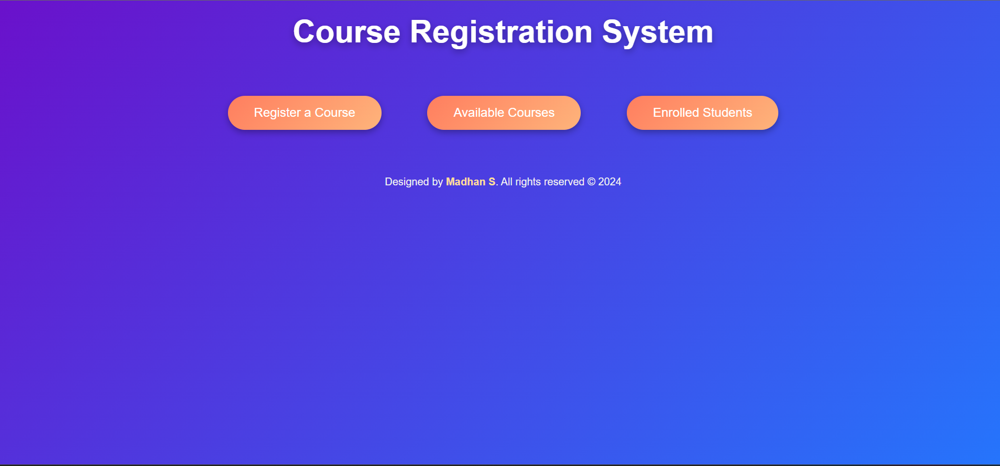
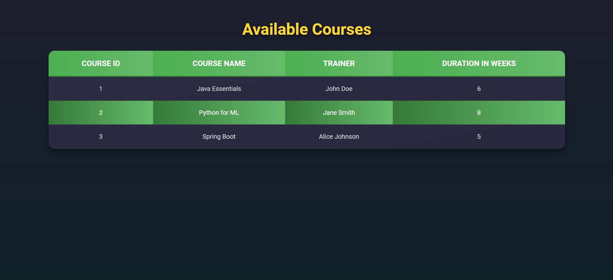
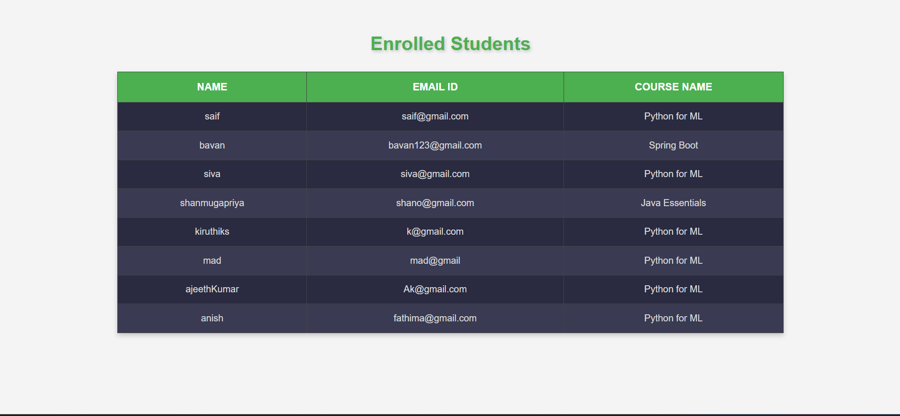

# Course Registration System

This is a web application for managing course registrations. The application is built using Spring Boot and MySQL for the backend and HTML, CSS, and JavaScript for the frontend.

## Features

- **Registration**: Students can register for courses.
- **Available Courses**: Display a list of courses available for registration.
- **Enrolled Students**: Display students enrolled in each course.

## Technologies Used

### Backend
- **Spring Boot**: RESTful API development.
- **MySQL**: Database management.

### Frontend
- **HTML/CSS**: Markup and styling.
- **JavaScript**: Dynamic functionality and interaction.

## Prerequisites

### Backend
- Java 21 or later
- Spring Boot 3.x
- MySQL 8.x
- Maven 3.x or later

### Frontend
- Modern web browser
- Code editor (e.g., VS Code)

## Project Structure

```
Course-Registration-System/
|-- Course-Registration-System Backend/
|   |-- src/
|   |   |-- main/
|   |       |-- java/
|   |       |   |-- com.example.courseregistration/  # Backend source code
|   |       |-- resources/
|   |           |-- application.properties  # Configuration file
|-- Course-Registration-System Frontend/
|   |-- index.html  # Main HTML file
|   |-- css/
|   |   |-- styles.css  # Stylesheet
|   |-- js/
|       |-- app.js  # JavaScript functionality
```

## Installation and Setup

### Backend

1. Clone the repository:
    ```bash
    git clone https://github.com/yourusername/course-registration-system.git
    cd course-registration-system/Course-Registration-System Backend
    ```

2. Configure the database in `application.properties`:
    ```properties
    spring.datasource.url=jdbc:mysql://localhost:3306/course_registration
    spring.datasource.username=yourusername
    spring.datasource.password=yourpassword
    spring.jpa.hibernate.ddl-auto=update
    ```

3. Build and run the backend:
    ```bash
    mvn spring-boot:run
    ```

### Frontend

1. Navigate to the `Course-Registration-System Frontend` directory:
    ```bash
    cd ../Course-Registration-System Frontend
    ```

2. Open `index.html` in your web browser or deploy it to a web server.

## API Endpoints

### Courses
- **GET** `/api/courses`: Fetch all available courses.

### Registrations
- **POST** `/api/registrations`: Register for a course.

### Enrolled Students
- **GET** `/api/students`: Fetch all students enrolled in courses.

## Screenshots

### Home Page


### Available Courses


### Enrolled Students


### Registration Page


## Deployment

1. Deploy the backend to a server or cloud service (e.g., AWS, Heroku).
2. Host the frontend files on a web server (e.g., Apache, Nginx).
3. Ensure the frontend API requests are correctly configured to point to the backend server.

## Contribution

Contributions are welcome! Please create a pull request with detailed information about your changes.

## License

This project is licensed under the MIT License. See the `LICENSE` file for details.
